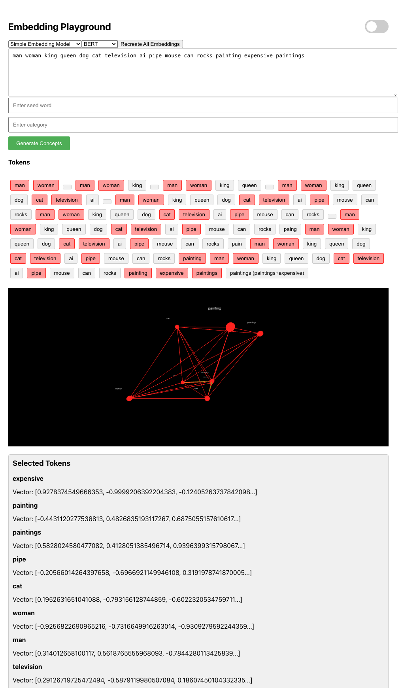
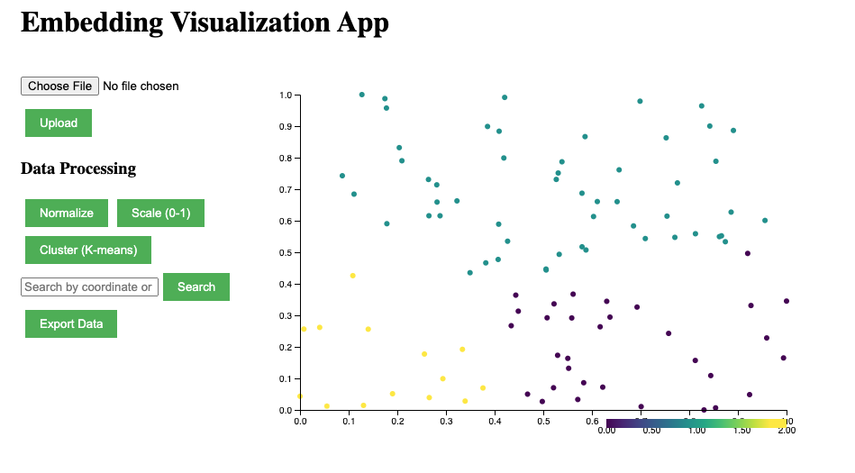
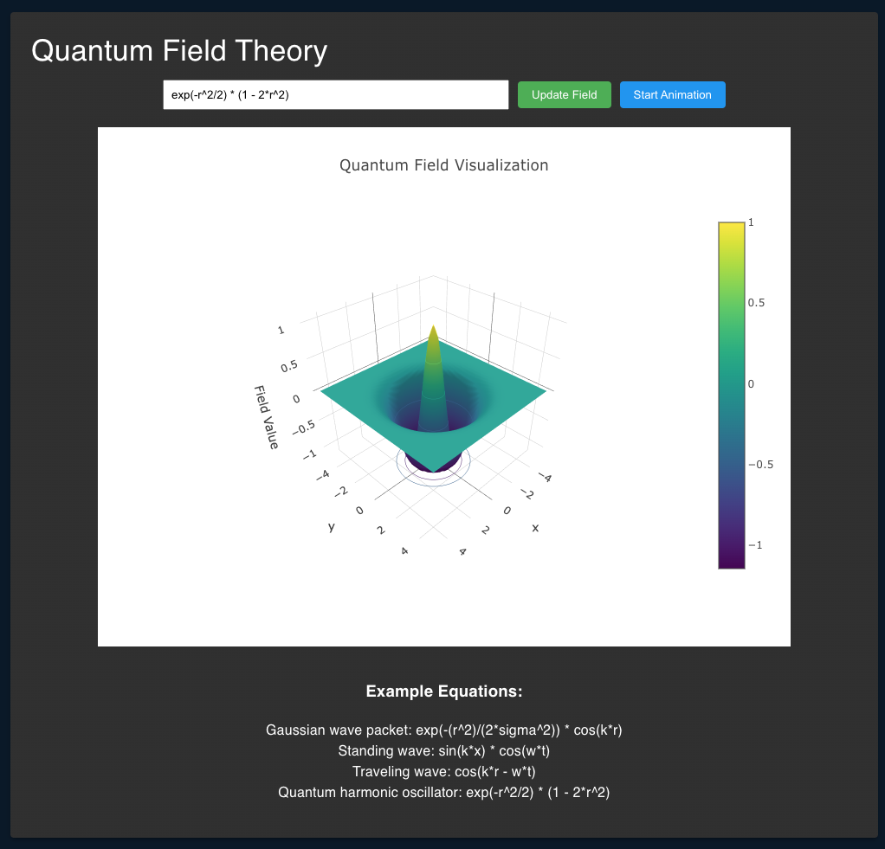

# Tensorium AI

Welcome to Tensorium AI - the home of experimental AI research and open-source development. We focus on pushing the boundaries of AI through practical implementations and innovative approaches to complex problems.

## Mission Statement

Tensorium AI is dedicated to advancing the field of artificial intelligence through open collaboration, experimental research, and the development of practical tools that bridge theoretical concepts with real-world applications. We believe in:

- Open source development that benefits the entire AI community
- Experimental approaches that challenge conventional thinking
- Building practical tools that solve real problems
- Fostering collaboration between researchers and developers

## Projects

| Project | Visualization |
|---------|---------------|
| **Continuum**  An experimental narrative engine for exploring alternate timelines through AI-driven story generation. Continuum provides: - Timeline expansion for building narrative graphs - Character initialization and development - Temporal consistency management - Transform prompts for narrative guidance - Exploration of alternate histories and possibilities  [Learn more about Continuum →](https://github.com/TensoriumAi/continuum) |  |

| Project | Visualization |
|---------|---------------|
| **AIrbitrator**  A universal AI protocol transformer with dynamic middleware and code execution capabilities. Features include: - Seamless transformation between AI service protocols - Dynamic middleware creation and modification - Runtime endpoint spawning and management - Self-modifying architecture with built-in tool system - Advanced protocol detection and transformation  [Learn more about AIrbitrator →](https://github.com/TensoriumAi/AIrbitrator) | Coming soon |

| Project | Visualization |
|---------|---------------|
| **Pump Fun Analytics**  A real-time token analytics platform providing advanced monitoring and analysis capabilities for cryptocurrency tokens. Key features: - Live token price and volume tracking - Automatic token discovery and tracking - Advanced trigger system with multi-condition evaluation - In-browser database system for efficient data management - Real-time WebSocket updates with automatic reconnection  [Learn more about Pump Fun Analytics →](https://github.com/TensoriumAi/pump-analytics) |  |

| Project | Visualization |
|---------|---------------|
| **Vector Toolset**  An innovative exploration platform designed to harness the power of embeddings and high-dimensional vector spaces. Features include: - Interactive visualization of word similarities in 3D space - Vector arithmetic and analogical reasoning - Custom logical operations in embedding space - Support for various embedding models (Word2Vec, BERT) - Experimental playground for vector reasoning  [Learn more about Vector Toolset →](https://github.com/TensoriumAi/VectorToolset) |  |

| Project | Visualization |
|---------|---------------|
| **Vector Visualization**  An interactive web application for visualizing and exploring high-dimensional embeddings using advanced dimensionality reduction techniques. Key features: - Interactive 2D visualization of embeddings - Dynamic zooming and panning - Point selection and information display - Data processing options (normalization, scaling) - Persistent storage with SQLite - Docker support for easy deployment  [Learn more about Vector Visualization →](https://github.com/TensoriumAi/VectorVisualization) |  |

| Project | Visualization |
|---------|---------------|
| **Unified Theory**  An experimental framework for exploring the intersection of physics and artificial intelligence. This project includes: - Quantum field theory simulations - General relativity modeling - Statistical mechanics implementations - Interactive visualization of physical phenomena - Real-time calculation of physical interactions  [Learn more about Unified Theory →](https://github.com/TensoriumAi/UnifiedTheory) |  |

## Getting Started

Each project contains its own detailed documentation and setup instructions. Choose a project that interests you and follow the README in its directory for specific setup and usage guidelines.

## Contributing

We welcome contributions from the community! Whether you're interested in:
- Adding new features
- Fixing bugs
- Improving documentation
- Sharing ideas

Please read our [Contributing Guidelines](CONTRIBUTING.md) for details on our code of conduct and the process for submitting pull requests.

## License

All projects are licensed under their respective licenses. Please check individual project directories for specific license information.

## Contact

- GitHub Issues: Use the appropriate project's issue tracker
- Discussions: Join our [GitHub Discussions](../../discussions)

## Acknowledgments

Special thanks to all contributors and researchers who have helped shape these projects through their valuable input and contributions.